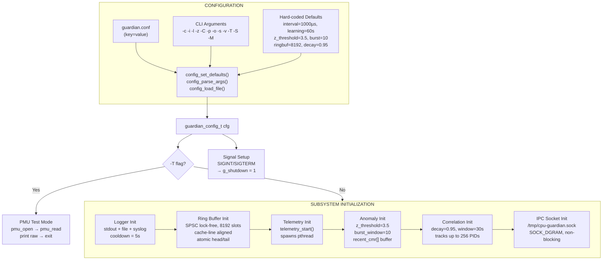
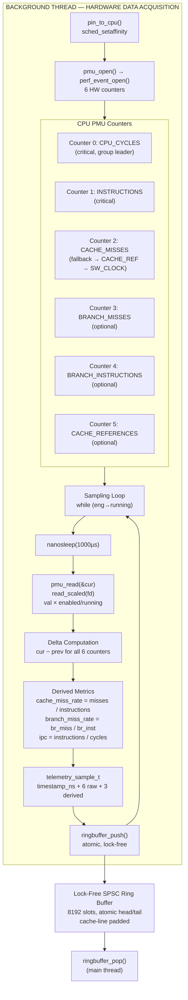
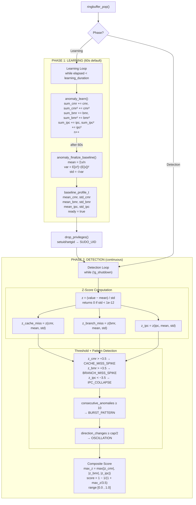
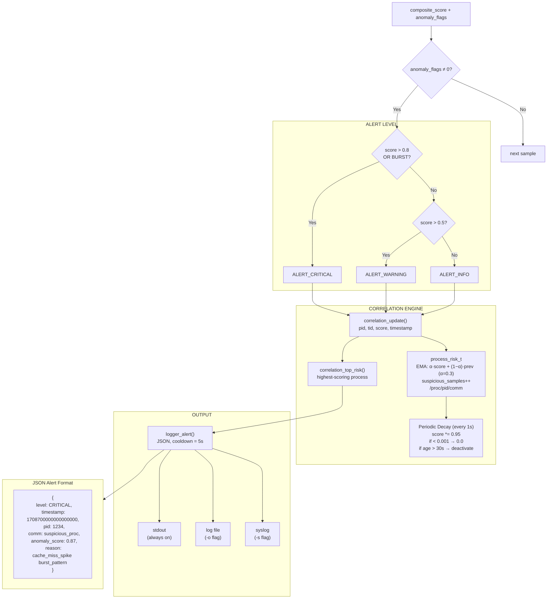

# CPU Guardian — Real-Time Side-Channel Attack Detection Engine

A production-grade, research-oriented defensive security engine written in pure C that detects potential CPU side-channel attacks in real time by analyzing microarchitectural behavior through hardware performance counters (PMU). Optional Python ML module (Isolation Forest + One-Class SVM) can run in parallel over a Unix socket for ensemble anomaly detection.

**This is NOT an exploit tool. This is a defensive runtime detection engine.**

Full ASCII version: **[PIPELINE.txt](PIPELINE.txt)**

---

## System Pipeline

```mermaid
flowchart TB
    subgraph ML_HYBRID["ML HYBRID ARCHITECTURE — IPC DATA FLOW"]

        subgraph C_SIDE["C Process (cpu-guardian)"]
            C_MAIN["Main Loop"]
            C_DETECT["anomaly_detect()\nC fallback (z-score)"]
            IPC_SEND["ipc_socket_send()\n68 bytes per datagram"]
            C_MAIN --> C_DETECT
            C_MAIN --> IPC_SEND
        end

        IPC_SEND -->|"Unix Domain Socket\nSOCK_DGRAM, non-blocking\n/tmp/cpu-guardian.sock"| SOCK

        subgraph PY_SIDE["Python Process (guardian_ml.py)"]
            SOCK["Socket Receive\nstruct.unpack()"]
            FEAT["Feature Engineering (14 features)\nRaw: cmr, bmr, ipc (3)\nRolling Mean: window=32 (3)\nRolling Std: window=32 (3)\nDelta: rate of change (3)\nCross: cmr×ipc, bmr×ipc (2)"]
            SOCK --> FEAT

            FEAT --> ML_PHASE{Phase?}

            ML_PHASE -->|Learning| ACCUM["Accumulate 5000 samples"]
            ACCUM --> TRAIN["Train Models\nStandardScaler.fit()\nIsolationForest (n=200)\nOneClassSVM (nu=0.01)\nDiversity check"]

            ML_PHASE -->|Detection| SCALE["StandardScaler.transform()"]
            SCALE --> IF_MODEL["Isolation Forest\npredict() + score()"]
            SCALE --> SVM_MODEL["One-Class SVM\npredict() + score()"]

            IF_MODEL & SVM_MODEL --> ENSEMBLE{"Ensemble Decision"}
            ENSEMBLE -->|"Both = anomaly"| ML_CRIT["CRITICAL"]
            ENSEMBLE -->|"One = anomaly"| ML_WARN["WARNING"]
            ENSEMBLE -->|"Both = normal"| ML_NORM["NORMAL"]

            ML_NORM --> RETRAIN_BUF["Add to retrain buffer\n(normal samples only)"]
            RETRAIN_BUF -->|"every 5 min"| TRAIN

            ML_CRIT & ML_WARN --> ML_ALERT["JSON alert output\nif_score, svm_score\nmodel_agreement"]
        end
    end
```

```mermaid
flowchart TB
    subgraph SHUTDOWN["SHUTDOWN (SIGINT / SIGTERM)"]
        SIG["signal_handler()\ng_shutdown = 1"]
        SIG --> TEL_STOP["telemetry_stop()\nrunning=false\npthread_join\npmu_disable, pmu_close"]
        SIG --> ANOM_DEST["anomaly_destroy()\nfree(recent_cmr)"]
        SIG --> RB_DEST["ringbuffer_destroy()\nfree(buffer)"]
        SIG --> IPC_CLOSE["ipc_socket_close()"]
        TEL_STOP & ANOM_DEST & RB_DEST & IPC_CLOSE --> LOG_DEST["logger_destroy()\nfclose(file), closelog()"]
        LOG_DEST --> EXIT["Print summary\nTotal samples: N\nAnomalies: M\nEXIT_SUCCESS"]
    end

    subgraph DETECT_TABLE["Detection Capabilities"]
        direction LR
        subgraph C_DETECT_T["C-side (z-score fallback)"]
            D1["CACHE_MISS_SPIKE → Prime+Probe, Flush+Reload"]
            D2["BRANCH_MISS_SPIKE → Spectre branch abuse"]
            D3["IPC_COLLAPSE → Microarch contention"]
            D4["BURST_PATTERN → Active probing (10+ consecutive)"]
            D5["OSCILLATION → Cache thrashing / jitter"]
        end
        subgraph ML_DETECT_T["Python ML (ensemble primary)"]
            M1["Isolation Forest (n=200) → multi-modal, fast"]
            M2["One-Class SVM (nu=0.01) → tight boundary"]
            M3["Both agree → CRITICAL (5-10x FP reduction)"]
            M4["One flags → WARNING (early warning)"]
            M5["Retrain every 5min → adaptive, anti-poison"]
        end
    end

    subgraph MODULE_MAP["Module Dependency"]
        direction TB
        MAIN["main.c"] --> CONFIG_M["config.c/h"]
        MAIN --> PMU_M["pmu.c/h"]
        MAIN --> TEL_M["telemetry.c/h"]
        MAIN --> RB_M["ringbuffer.c/h"]
        MAIN --> ANOM_M["anomaly.c/h"]
        MAIN --> CORR_M["correlation.c/h"]
        MAIN --> LOG_M["logger.c/h"]
        MAIN --> IPC_M["ipc_socket.c/h"]
        PMU_M --> TEL_H["telemetry.h\n(telemetry_sample_t)"]
        TEL_M --> TEL_H
        ANOM_M --> TEL_H
        IPC_M --> TEL_H
        IPC_M -->|"Unix Socket"| ML_PY["guardian_ml.py\nnumpy + scikit-learn"]
    end
```













## Modules

### 1. PMU Interface Layer (`pmu.c/h`)
Wraps the Linux `perf_event_open` syscall. Monitors six hardware performance counters:
- **Cache references** and **cache misses** — detect cache-based attacks
- **Branch instructions** and **branch misses** — detect branch predictor abuse
- **Instructions retired** and **CPU cycles** — detect IPC anomalies

Supports per-core and per-process modes with automatic multiplexing scale factor correction.

### 2. Telemetry Engine (`telemetry.c/h`)
A dedicated sampling thread pinned to a CPU core via `sched_setaffinity`. Reads PMU counters at configurable intervals using `CLOCK_MONOTONIC_RAW` and computes delta-based derived metrics:
- `cache_miss_rate = cache_misses / instructions`
- `branch_miss_rate = branch_misses / branch_instructions`
- `ipc = instructions / cycles`

### 3. Lock-Free Ring Buffer (`ringbuffer.c/h`)
Single-producer / single-consumer ring buffer using C11 `<stdatomic.h>`:
- Power-of-2 capacity with bitmask indexing
- Cache-line padded head/tail to prevent false sharing
- Proper acquire/release memory ordering
- Zero-copy in-place writes

### 4. Statistical Anomaly Engine (`anomaly.c/h`)
The core detection logic operates in two phases:

**Learning Phase** (configurable, default 60s):
- Collects baseline statistics using Welford-style online mean/variance

**Detection Phase** (continuous):
- **Z-score analysis**: Flags samples where `|z| > threshold` for cache miss rate, branch miss rate, or IPC
- **Burst detection**: Tracks consecutive anomalous samples; fires `BURST_PATTERN` after N sustained anomalies
- **Oscillation detection**: Identifies high-frequency alternating patterns in the sliding window
- **Composite risk score**: Sigmoid-mapped maximum z-score, normalized to [0, 1]

### 5. Process Correlation Layer (`correlation.c/h`)
Maps detected anomalies to processes:
- Reads `/proc/[pid]/comm` for process identification
- Maintains per-PID risk scores with exponential moving average
- Applies time-based decay to prevent stale entries from persisting
- Tracks suspicious sample counts per process

### 6. Alert & Logging Engine (`logger.c/h`)
Outputs structured JSON alerts:
```json
{
  "level": "CRITICAL",
  "timestamp": 1234567890,
  "pid": 1234,
  "comm": "suspicious_proc",
  "anomaly_score": 0.87,
  "reason": "cache_miss_spike burst_pattern"
}
```
Supports stdout, file, and syslog backends with configurable cooldown to prevent alert storms.

### 7. Config System (`config.c/h`)
Parses key=value config files and CLI arguments:
```
sampling_interval_us=1000
learning_duration_sec=60
z_threshold=3.5
burst_window=10
```

---

## Detection Logic

### What CPU Guardian detects:

| Pattern | Indicator | Attack Type |
|---------|-----------|-------------|
| Cache miss rate spike | Z-score > threshold | Prime+Probe, Flush+Reload |
| Branch miss rate spike | Z-score > threshold | Spectre-variant branch abuse |
| IPC collapse | Negative Z-score | Microarchitectural contention |
| Sustained burst | N consecutive anomalies | Active side-channel probing |
| Oscillation pattern | Rapid high/low alternation | Timed probing sequences |

### How it differs from traditional IDS:
1. **Hardware-level telemetry** — operates below the OS, using CPU performance counters that cannot be spoofed by userspace malware
2. **Behavioral, not signature-based** — detects statistical anomalies rather than known attack patterns
3. **Minimal overhead** — lock-free architecture, < 5% CPU impact
4. **Real-time** — microsecond-resolution sampling with nanosecond timestamps
5. **Research-oriented** — extensible baseline and detection algorithms

---

## Platform requirements

- **OS**: Linux (kernel 3.14+ with `perf_event_open`; tested on Ubuntu 22.04+)
- **Architecture**: x86_64 (PMU events used are standard Linux `PERF_TYPE_HARDWARE`; no CPU-model-specific events)
- **Privileges**: Root or `CAP_PERFMON` for PMU access; the process drops privileges after opening counters when run via `sudo`
- **VM**: Works on bare metal. Inside VMs, PMU support is often limited: the code uses only generic hardware events (cycles, instructions, cache_misses, branch_misses, etc.) and does **not** use `topdown-*`, `TOPDOWN.SLOTS`, or `cycles:u`-style events. If your VM returns ENOENT for `cpu=-1`, the code falls back to `cpu=0` automatically. For best results, run on real hardware or a VM with PMU passthrough.

---

## Build

Requires Linux x86_64 with kernel support for `perf_event_open`.

**Recommended compiler flags** (already used by the Makefile):  
`-std=c17 -Wall -Wextra -Wpedantic -O2 -D_GNU_SOURCE`

```bash
# Release build
make

# Debug build with AddressSanitizer + UBSan
make debug

# Build synthetic test workloads
make test

# Clean
make clean
```

## Usage

```bash
# System-wide monitoring (requires root or CAP_PERFMON)
sudo ./bin/cpu-guardian -v

# Monitor specific CPU core
sudo ./bin/cpu-guardian -C 0 -v

# Monitor specific process
sudo ./bin/cpu-guardian -p 1234 -v

# Use config file
sudo ./bin/cpu-guardian -c guardian.conf -v

# Custom parameters
sudo ./bin/cpu-guardian -i 500 -l 30 -z 3.0 -o /tmp/alerts.log -v
```

### Hybrid mode (C + ML)

Optional Python ML engine (Isolation Forest + One-Class SVM) receives samples over a Unix socket. If the ML process is not running, the C binary uses only its built-in z-score detection.

```bash
# Terminal 1: start ML engine first (binds socket)
cd ml/
pip install -r requirements.txt
python3 guardian_ml.py --verbose

# Terminal 2: start C collector (sends to socket; default path /tmp/cpu-guardian.sock)
sudo ./bin/cpu-guardian -c guardian.conf -v
```

Use `-S PATH` to set socket path, or `-M` to disable ML output (C-only detection). See [PIPELINE.txt](PIPELINE.txt) for the full IPC and ML flow.

### CLI Options
```
  -c FILE    Configuration file path
  -i USEC    Sampling interval (microseconds)
  -l SEC     Learning duration (seconds)
  -z THRESH  Z-score threshold
  -C CPU     Target CPU core (-1 = all)
  -p PID     Target PID (-1 = system-wide)
  -o FILE    Log output file
  -s         Enable syslog output
  -v         Verbose mode
  -T         PMU test mode: open counters, read once, print raw values, exit
  -S PATH    ML engine Unix socket path (default: /tmp/cpu-guardian.sock)
  -M         Disable ML output (C-only detection)
  -h         Show help
```

### Runtime compatibility (perf events)

CPU Guardian uses only these standard Linux PMU events (no topdown, no `:u` modifiers):

- `PERF_COUNT_HW_CPU_CYCLES`
- `PERF_COUNT_HW_INSTRUCTIONS`
- `PERF_COUNT_HW_CACHE_MISSES` (fallback: CACHE_REFERENCES, then SW CPU_CLOCK)
- `PERF_COUNT_HW_BRANCH_MISSES`
- `PERF_COUNT_HW_BRANCH_INSTRUCTIONS`
- `PERF_COUNT_HW_CACHE_REFERENCES` (optional)

To see what your kernel supports: `perf list hardware` and `perf list software`. If cycles and instructions are available, the detector can run; other events degrade gracefully (unopened counters read as 0).

## Testing

Run the synthetic workload generator alongside cpu-guardian:

```bash
# Terminal 1: Start the detector
sudo ./bin/cpu-guardian -v -l 10

# Terminal 2: Run normal baseline (mode 1)
./bin/test_synthetic 1 30

# Terminal 2: Run cache stress attack (mode 2)
./bin/test_synthetic 2 30

# Terminal 2: Run branch misprediction attack (mode 3)
./bin/test_synthetic 3 30

# Terminal 2: Run mixed attack pattern (mode 4)
./bin/test_synthetic 4 30
```

### Test Modes:
| Mode | Description | Expected Detection |
|------|-------------|-------------------|
| 1 | Sequential access, predictable branches | No anomalies (baseline) |
| 2 | Random 64MB access (cache thrashing) | `cache_miss_spike`, `burst_pattern` |
| 3 | Unpredictable branch patterns | `branch_miss_spike` |
| 4 | Alternating cache + branch bursts | Multiple flags, `oscillation` |

---

## Performance

- **Target overhead**: < 5% CPU
- **Architecture**: Lock-free SPSC ring buffer, dedicated sampling thread
- **Memory**: Fixed allocation at startup, no runtime heap allocations in hot path
- **Scalability**: One telemetry thread per monitored core

## Security Considerations

- Requires `root` or `CAP_PERFMON` capability for PMU access
- Drops privileges after PMU initialization when run via `sudo`
- All buffer sizes are bounded; no unbounded allocations
- Built with `-Wall -Wextra -Wpedantic`; debug mode includes AddressSanitizer

## Future Extensions

- eBPF integration for kernel-level event correlation
- Hypervisor-level monitoring (KVM/Xen)
- Online clustering for unsupervised anomaly grouping
- Risk heatmap visualization
- Web dashboard with real-time charts
- Adaptive sampling interval based on system load
- Multi-core coordinated detection

---

## Research Background

CPU side-channel attacks exploit shared microarchitectural resources (caches, branch predictors, TLBs) to leak information across security boundaries. Notable attacks include:

- **Spectre** (CVE-2017-5753, CVE-2017-5715) — branch prediction abuse
- **Meltdown** (CVE-2017-5754) — out-of-order execution
- **Prime+Probe** — cache set contention timing
- **Flush+Reload** — shared cache line monitoring

CPU Guardian provides a runtime behavioral detection layer that complements hardware/firmware mitigations by monitoring the statistical footprint these attacks leave in PMU counter data.

## License

Research / Educational use.

---

## Repository layout

```
cpu-guardian/
├── PIPELINE.txt      # Full system pipeline diagram (config → detection → ML)
├── README.md
├── Makefile
├── guardian.conf     # Default config (key=value)
├── LICENSE
├── .gitignore
├── src/              # C source
│   ├── main.c
│   ├── config.c, config.h
│   ├── pmu.c, pmu.h
│   ├── telemetry.c, telemetry.h
│   ├── ringbuffer.c, ringbuffer.h
│   ├── anomaly.c, anomaly.h
│   ├── correlation.c, correlation.h
│   ├── logger.c, logger.h
│   └── ipc_socket.c, ipc_socket.h
├── ml/               # Optional ML detection engine
│   ├── guardian_ml.py
│   └── requirements.txt
├── tests/
│   └── test_synthetic.c
├── bin/               # Created by make (cpu-guardian, test_synthetic)
└── obj/               # Created by make (.o files)
```

For a detailed visual pipeline (data flow, formulas, wire format), see **[PIPELINE.txt](PIPELINE.txt)**.
